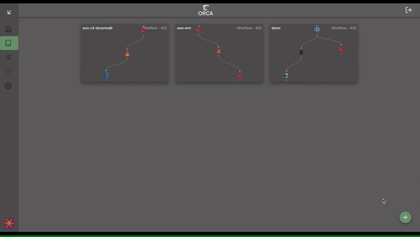

<div id="top"></div>

<!-- PROJECT LOGO -->
<br />
<div align="center">
  <a href="https://orcaworkflows.com">
    
  </a>

  <h3 align="center">Orca Workflows</h3>

  <p align="center">
    No-code data orchestration platform.
    <br />
    <a href="https://orcaworkflows.com"><strong>Explore»</strong></a>
    <br />
    <br />
    <a>
    This repository consists of all of Orca Workflows' components. Please refer to below
    </a>
    <br />
    <a href="https://github.com/OrcaWorkflows/orca/orca">Orca</a>
    |
    <a href="https://github.com/OrcaWorkflows/orca/service">Orca Service</a>
    |
    <a href="https://github.com/OrcaWorkflows/orca/operators">Orca Operators</a>
    |
    <a href="https://github.com/OrcaWorkflows/orca/charts">Orca Charts</a>
    <br />
    <br />
    <a href="https://www.orcaworkflows.com/#about">View Demo</a>
    ·
    <a href="https://github.com/OrcaWorkflows/orca/issues">Report Bug</a>
    ·
    <a href="https://github.com/OrcaWorkflows/orca/issues">Request Feature</a>
  </p>
</div>

<!-- TABLE OF CONTENTS -->
<details>
  <summary>Table of Contents</summary>
  <ol>
    <li>
      <a href="#about-the-project">About The Project</a>
      <ul>
        <li><a href="#built-with">Built With</a></li>
      </ul>
    </li>
    <li>
      <a href="#getting-started">Getting Started</a>
      <ul>
        <li><a href="#prerequisites">Prerequisites</a></li>
        <li><a href="#installation">Installation</a></li>
      </ul>
    </li>
    <li><a href="#usage">Usage</a></li>
    <li><a href="#roadmap">Roadmap</a></li>
    <li><a href="#contributing">Contributing</a></li>
    <li><a href="#license">License</a></li>
    <li><a href="#contact">Contact</a></li>
    <li><a href="#acknowledgments">Acknowledgments</a></li>
  </ol>
</details>

<!-- ABOUT THE PROJECT -->
## About The Project
<p align="center">
    
</p>

Orca Workflows is no-code data orchestration platform which allows users to build data workflows with no learning curve.

<!-- GETTING STARTED -->
## Getting Started

OrcaWorkflows runs on Kubernetes cluster. There are several repositories that forms Orca Workflows as a system.

* **[Orca](https://github.com/OrcaWorkflows/orca)**: User interface of the system.
* **[Orca Service](https://github.com/OrcaWorkflows/orca/service)**: Backend service based on Spring Boot framework.
* **[Orca Operators](https://github.com/OrcaWorkflows/orca/operators)**: Modules responsible for data operations invoked by Argo.
* **[Orca Charts](https://github.com/OrcaWorkflows/orca/charts)**: Kubernetes charts for deployment.

### Prerequisites

* Docker
* Kubernetes cluster
* Argo workflows

### Installation
1. Clone the repo
      ```sh
      git clone https://github.com/OrcaWorkflows/orca
      ```
2. Build&deploy docker images of operators, orca and service. Please refer to build&deploy instructions in their respective locations.
3. Clone charts. To install all configurations and applications into Kubernetes cluster, please refer to the instructions in charts.
4. Login to the system with admin credentials through [YOUR_K8S_HOST_IP:SERVICE_PORT(default=30300)].


<!-- USAGE EXAMPLES -->
## Usage

_Check out demo and blogs. [Orca Workflows Demo](https://www.orcaworkflows.com/#about)_


<!-- ROADMAP -->
## Roadmap

- [x] Add Scheduling feature
    - [x] Backend
    - [ ] Frontend
- [ ] Full GCP integration
- [ ] UX Enhancements
- [ ] Add data preview feature
    - [ ] A dynamic interface
- [ ] Add data persistence feature
- [ ] Add export/import feature


See the [open issues](https://github.com/OrcaWorkflows/orca/issues) for a full list of proposed features (and known issues).

Note: GCP is not fully functional unless you specify your own GCP configuration via volume mounts.
<!-- CONTRIBUTING -->
## Contributing

Contributions are what make the open source community such an amazing place to learn, inspire, and create. Any contributions you make are **greatly appreciated**.

If you have a suggestion that would make this better, please fork the repo and create a pull request. You can also simply open an issue with the tag "enhancement".
Don't forget to give the project a star! Thanks again!

1. Fork the Project
2. Create your Feature Branch
3. Commit your Changes
4. Push to the Branch
5. Open a Pull Request


<!-- LICENSE -->
## License

Distributed under the Apache 2.0 License. See `LICENSE.txt` for more information.


<!-- CONTACT -->
## Contact

Burak Altas - [@BurakkAltas](https://twitter.com/BurakkAltas) - burak.altas@gmail.com

<p align="right">(<a href="#top">back to top</a>)</p>

<!-- MARKDOWN LINKS & IMAGES -->
<!-- https://www.markdownguide.org/basic-syntax/#reference-style-links -->
[product-screenshot]: orca/public/demo.gif
